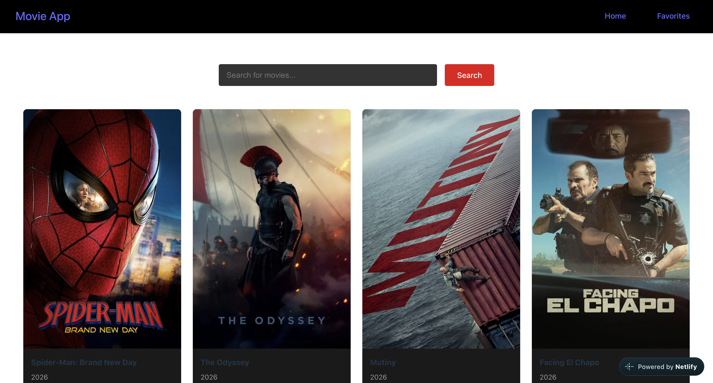

<div align="center">

# 🎬 Movie Search Engine

**A movie search application built with React that allows users to discover popular movies, search for specific titles, and save their favorites.**


</div>

---

## 🌐 Live Demo

👉 [View Live Demo](https://movie-search-engine-juli.netlify.app/)

## 📸 Preview
 

---

## ✨ Features

- 🎥 Browse popular movies
- 🔎 Search movies by title
- ❤️ Add and remove movies from favorites
- 📱 Responsive design for desktop and mobile
- 🔐 API key protected using Netlify Functions
- ⚡ Dynamic data fetched from the TMDB API

---

## 🛠️ Technologies

- **React**
- **JavaScript**
- **Vite**
- **TMDB API**
- **Netlify Functions**
- **CSS**

---

## 🚀 Getting Started

**1. Clone the repository**

```bash
git clone https://github.com/TU-USUARIO/movie-search-engine.git
cd movie-search-engine
```

**2. Install dependencies**

```bash
npm install
```

**3. Configure environment variables**

Create a `.env` file in the root directory:

```env
TMDB_API_KEY=your_api_key_here
```

> ⚠️ Never commit your `.env` file to GitHub.

**4. Start the development server**

```bash
npm run dev
```

The application will be available at the local address provided by Vite.

---

## 🎞️ API

Movie information is provided by [The Movie Database (TMDB)](https://www.themoviedb.org/).
